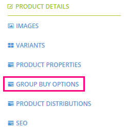
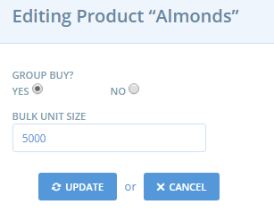

# Group Buy - for bulk ordering

The Group Buy function is designed for enterprises who purchase some of their incoming stock in bulk quantities. For such enterprises, the decision of whether to order a certain product is dependent on whether customers have collectively ordered enough to justify a bulk purchase. This may be due to volume discounts, or delivery fees. The group buy function makes it easier for the hub to achieve bulk buying efficiencies.

When a product is allocated to group buy it will display differently in the shopfront \(see below\).

Customer are asked to indicate:

* Their minimum quantity- this is the amount of the product they ideally want.
* Their maximum quantity- this is the maximum amount they would be willing to buy.

Essentially this is a way for the customer to say ‘you have my permission to increase my order up to this point, if it means that as a group, we can achieve the bulk order quantity’.

In [Bulk Order Management ](../orders/)you can view the total minimum and maximum order quantities for the product, from all of your customers. Then you can either raise customer orders, within their acceptable range, to achieve the bulk quantity, or if the maximum order quantity falls short, you can delete all orders for this product.

## Applying group buy to a product

Let’s use an example of almonds to illustrate, whereby a total order quantity of at least 5kg is required.

To designate the group buy feature to a product, go to **Products **in the horizontal blue menu, and then click **edit **next to the corresponding product \(see below\).

Then select **Group Buy Options** in the menu to the right.

Select **Yes **under **Group Buy to activate this feature for the product**.

The **Group Buy Unit Size **is the amount that the group’s collective order needs to reach. In this case we need a total order of 5kg or more, so I’ll write 5000.

> Note: The Group Buy Unit Size is in g \(for products sold by weight\) and L \(for products sold by volume\).

## Adjusting orders in Bulk Order Management

In [bulk order management](../orders/) you can view and edit customer orders for Bulk Buy products. In this case, I want to see if my customers have ordered at least 5kg of almonds. If they haven’t, I also want to see if I can raise their orders, according to their designated max quantities, to reach this 5kg threshold.

1. Firstly I would select the order cycle or date range of interest.
2. Then I would search for the product ‘almonds’.
3. Make sure the ‘Max’ column is displayed so I can see each customers maximum order quantity.
4. Next, click on Almonds in the Product:Unit column, to display the orders total box. Here I can see the cumulative minimum and maximum orders. In this case, the **total quantity ordered **is 4kg, which falls short of my bulk order quantity. But the

   **max quantity ordered **is 6kg, which shows that some customers are willing to raise their orders.

5. Next, I can look at each customer’s max value, and raise their order **Quantity**, until the 5kg threshold is reached. Note: any changes to quantity will will be automatically captured in the price column.
6. Click update to save changes to customer orders.

_**What does Current Fulfilled Orders and Max Fulfilled Order tell me?**_

**Current Fulfilled Orders **divides your total quantity ordered by the group buy unit size. If this figure is greater than 1, it tells you that the existing customer order satisfy or exceed your required group buy unit size. If this figure is less than 1, existing customer orders don’t meet that threshold. As you raise the quantity of customer orders, this figure will raise.

**Max Fulfilled Order** takes the sum or all of the customer’s MAX order quantities and divides this by the Group Buy Unit Size. If the number is over 1, then you know that the total of your MAX orders exceeds the required group buy quantity. If it’s below zero, it means that even the MAX order quantities won’t reach the threshold.

### Group Buy Report

The “Bulk Co-op – Totals By Suppliers Report” provides a summary of your bulk products including how many bulk sizes to order, how much remaining stock will be left over and how much extra stock customers are willing to purchase to help the group reach the bulk order size. For details of how to use this report, see the bottom of [this page](../../basic-features/reports.md).

