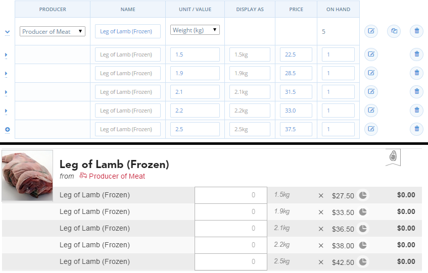

# Pricing irregular items \(kg\)

When listing meat products with a standard size and price \(eg 6 pack of sausages, $9\), or products that are divisible \(eg mince meat\) adding product prices is straightforward. However, when it comes to adding products that are irregular in size and can’t be divided, like chickens or legs of lamb, pricing become a little more complex. There are a couple of ways that producers can work around these challenges.

Let’s take an example. A producer sells legs of lamb. They usually weight between 1.5-2.5kg, and he charges $15/kg for them. Because each leg is unique he cannot list the product as a simple Leg of Lamb, with a set price. Some options are discussed below.

## Charge for the average weight and reimburse

You can charge the average price of the product, and then reimburse or charge the customer extra, if the actual weight deviates from this. So in this example, he would charge $30/leg, based on an average of 2kg. When the actual leg is weighed and packed, he may calculate a 500g deviation, requiring him to reimburse $7.50.

When you know the real weight of your products, you can update orders in [Bulk Order Management](../orders/). Search for the Leg of Lamb so that you view all orders containing this product. Make the ‘weight/volume’ column visible. The values in this column can be edited to reflect the real weights of the legs of lamb allocated to each customer. The example below shows that when Claire’s order is adjusted to a 1.5kg leg of lamb, the price automatically recalculates. Click update to save this change.

Now, when you view Claire’s order, the correct total will display, and all reports will reflect this change. You may wish to resend the order confirmation to the customer as well.

## List the product in weight ranges

This is a similar approach to above, but instead of listing the average you can list weight ranges, to increase the likelihood that the customer gets a product of the size they prefer. For instance, you can give the customer a choice between a smaller leg \(1.5-2kg\) and a larger leg \(2-2.5kg\). These can be created as 2 variants. The price for each size can be calculated based on the average, the upper or the lower end of the weight range. If you price based on the upper limit, you’ll more likely need to reimburse the customer. If you price based on the lower, you’ll more likely need to request additional payment. You can create as many weight increments as you like, and can cater to.

## Listing unique, individual items \(e.g. frozen products\)

If you have the unique items on hand, you can list each individual item, with its accurate weight and price. For instance, the example below shows pre-weighed and packed frozen legs of lamb listed as unique variants, with an on hand value of 1. The image below shows how the product variants are entered, and how they will display in the shopfront.

## Irregular supply

It can be difficult for meat producers to predict the exact products they will have until after processing. For example, a poultry producer may expect to have 12 medium chickens, but after a fox attack, only 6 remain, and 6 smaller ones. Therefore the producer needs to be able to adjust orders, to alert customers to the shortage, and the corresponding change in their order. The product may be removed from their order, or substituted with something similar.

Orders can be adjusted in [Orders Listing](../orders/). Alert the customer to any changes in their order.

## Reimbursing or collecting additional payment on the OFN

Reimbursing or collecting additional payment is the most straightforward when the Payment Method is cash on collection or delivery.

An alternative to reimbursing, is to request that customers only pay 80% at checkout, and the other 20% once the order is confirmed. This 20% may change according to the final prices. The OFN doesn’t have an automated tool for this. Instead you’ll need to place these instructions in the Payment Method description, which will display to the customer at checkout and in their order confirmation email. However, be prepared to have customers miss these instructions.

In the future, the OFN is planning to develop customer accounts, which can track refunds and allow stores to generate ‘store credits’

## Alerting customers to your pricing policy

Each OFN store has the option of placing a message at the top of their shopfront. This is an opportune place to let customers know that prices can vary after the order is placed. Instructions to do this are [here](../your-profile/), under Shop Preferences.

The Payment Method description box is another place to send a message to the customer, such as ‘the final price may vary by a maximum of 10% due to product variability, we will contact you for variations greater than this’. Instructions for creating this message are [here](../../basic-features/payment-methods.md).

