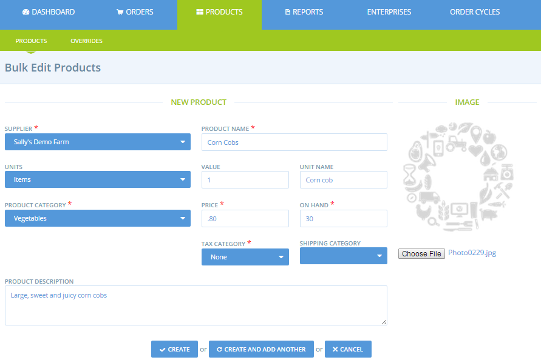

# Product variants

If you are listing two or more products which are very similar, but only vary on price, or size, or something like flavour, it is best to create a ‘variant’ for that product, rather than creating multiple, separate products. This will make the listing clearer to customers and prevent your store from becoming cluttered.

Using an example of Corn Cobs, let’s imagine that you want to sell individual corn cobs for 80c each, or 5 corn cobs for the discounted price of $3. Each of these products will be a product variant. Below, is the final product listing on the OFN store. The following section will describe the steps involved in creating this listing.

When you first create the product, fill out the details of one of your product variants \(one corn cob for 80c\). More detailed instructions for adding a product are [here](../../basic-features/products.md).

On the **Bulk Edit Products **page, you will see the previously created product ‘corn cobs’. By clicking on the plus symbol to the left of the product, a new variant will be created below. Because we will have two variants, we’ll need to click this button twice \(the original does not count once a variant is created\). You’ll now see two additional rows appear below the original product.

The top row represents this collection of variants. The name in this row, Corn Cobs, will be the heading of this collection of variants. We can leave the top row as it is.

The second row, will be the first variant \(1 Corn Cob, for 80c\).

* The **name **column will be automatically filled, from the original product. However, we want to overwrite this to say

  _Corn Cob_, instead of _Corn Cobs._

* In the **unit/value **column, we type 1 because this variant is for an individual cob.
* The **display as **column will automatically fill with ‘1 Corn Cobs’ in the store. This isn’t quite right, so we can overwrite this with _1 corn cob._
* Enter the **price **for this 1 Corn Cob \(.80\)
* Lastly indicate what quantity of this product you have **on hand.**

\*Note: If you leave the on hand field blank or as zero, the product will not be shown in your store, as it's out of stock.

The third row, will be for the second variant \(5 cobs for $3\).

* Because we want this variant to display as ‘5 corn cobs’, we can accept the automatically filled

  \_Corn Cobs \_in the **name **column.

* In the **unit/value **column, we type _5._
* The **display as **column will automatically fill with _5 Corn Cobs _, which is correct.
* Enter the **price **for 5 corn cobs \($3\)
* Lastly indicate what quantity of this product you have on hand.

Note: You can add as many variants as you like.

When finished, click **Save Changes**.

The diagram below shows the completed variant form for the corn cobs, and also how this will be presented in the online store.

An additional example of product variants is provided below.


You cannot currently set a stock level to apply across multiple variants. For example in the corn cob example above, I cannot indicate that I have 100 corn cobs to sell regardless of whether they are sold as single cobs or in bunches of 5. Therefore shop managers need to estimate how much stock to apply to the two variants.



 You cannot currently write unique product descriptions for each variant. If you need to give each variant a description you may wish to list the products as unique products, rather than as variants.


