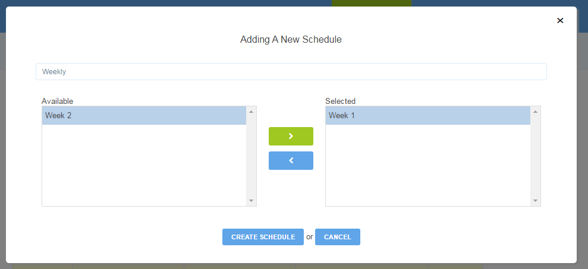
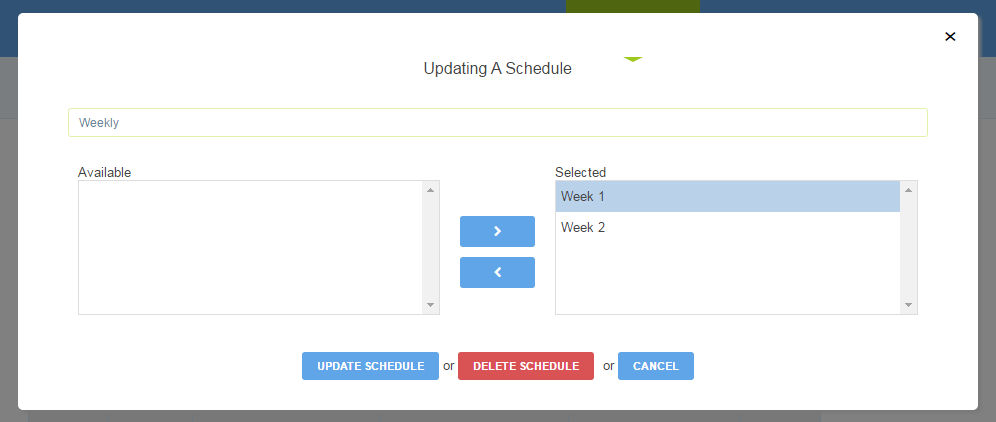

# Subscriptions - configuration


This feature is LAUNCHING SOON


## What are subscriptions?

Subscriptions is a tool which lets enterprises setup recurring or standing orders for their customers. The feature is both convenient for customers and beneficial for enterprises as it can boost customer loyalty and give more predictability to order volumes.

Here are the basic features of Subscriptions:

* Customers can opt to have an recurring order which contains defined products and repeats periodically.
* Enterprises can give their customers the chance to pause, cancel and add/remove products from their subscriptions.
* Customers can grant the shop permission to automatically bill their credit card for their subscription.

## I want to use subscriptions in my shop- where do I start?

This page provides a detailed description of how to configure your shop to enable the subscription feature.

Once you have configured your shop, see the [Subscriptions - Creating and Managing Orders](https://github.com/ofn-user-guide/ofn-user-guide-master/tree/d5a1113e673b0e22198ca207b1db61339799868a/subscriptions/subscriptions-creating-and-managing-orders.md) page for information about creating and managing your customer's subscription orders.

## Subscriptions Configuration

To access the Subscription tool, you’ll need to first activate the feature in your enterprise’s settings. Once turned on, the additional subscription tabs and controls will become visible to you. These settings can be found in Manage your enterprise, in the **Shop Preferences** tab.

**Subscriptions**: To activate subscriptions, select Enable.

**Guest orders**: We recommend that shops offering subscriptions also require customers to login before they can shop with you. This will ensure that any customer with a subscription will login and see their existing subscription order, and not accidentally place a duplicate order.

**Change orders**: Enterprises can choose whether or not customers are allowed to edit their subscription order while the order cycle is open. If you allow customer to change their order, they can remove items from the order or cancel the order. If customers want to add something to their order they will need to place a new order.

## Schedules

### About Schedules

Subscriptions are setup so that every time a shop opens an order cycle, orders are automatically generated for customers who have a subscription with that shop. However, the system has the added flexibility of allowing shops to decide which order cycles the subscription will apply in. This allows shops to have some order cycles which trigger subscription orders to be created, and some which do not.

Which order cycles trigger subscriptions is controlled through an additional element in the Order Cycle setup process, called ‘schedules’. Schedules are groups that order cycle can be assigned to. Once a schedule has been created, customer subscription are applied to the schedule, so that an order for their subscription will only be generated for new order cycles in that schedule.

Let’s clarify this with an example:

**Example 1**

Harvest Hub runs weekly order cycles. Customers are able to subscribe to either a weekly, or fortnightly order.

In this case there will be two schedules. One that contains all order cycles, for the weekly subscribers. And one that contains only every second order cycle, for the fortnightly subscribers.

#### Example 2

Delta Farm runs two order cycle a week, one for a Monday delivery and one for a Thursday delivery.

Most of their customers subscribe to one delivery a week, but some of their hospitality customers subscribe to both the Monday and Thursday delivery.

In this case there will be two schedules, one for the Monday customers and one for the Thursday customers. Those customers who want a subscription on both days can have a subscription applied to both schedules.

### Create a schedule

Once you have activated the subscription feature \(above\), you will see the Schedule functionality in the order cycle interface. To create a schedule click on the + New Schedule button.

Note: You must have at least one order cycle that can be added to the schedule before you create it.

**Name:** 

Give the schedule a logical name which describes this group of order cycles. E.g. ‘weekly’, ‘monthly’, ‘Tuesday Deliveries’, ‘wholesale’ or ‘retail’. This name is only visible to you in the backend, not to customers.

You can add existing order cycles into the new schedule by dragging them from the ‘available’ list and dropping into the ‘selected’ list, or by clicking to add/remove.

Click **create** when you are finished.

### Edit or Delete a schedule

To edit or delete a schedule, click on the schedule’s name next to a corresponding order cycle, in the ‘schedules’ column.

Note, this column may need to be made visible in the columns setting dropdown.

You can change the name of the order cycle, add/remove order cycles from it or delete the order cycle.

> Note: You cannot delete a schedule if there are subscriptions associated with it.

### Adding or removing order cycles from schedules

You can add and remove order cycles from schedules by either editing the schedule \(above\), or by editing the order cycle and adding/removing the schedule in the ‘schedules’ field \(below\).

Order cycle may be in more than one schedule. For instance, in the Harvest Hub example above, every second weekly order cycle will be in both the weekly schedule and the fortnightly schedule.

