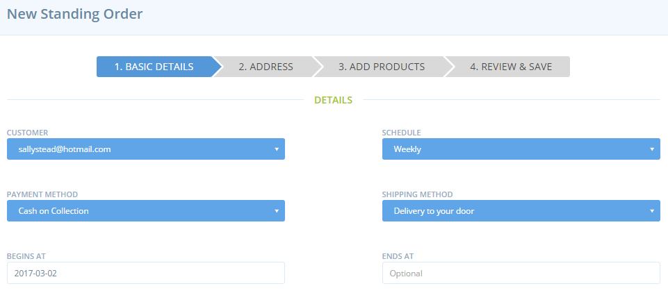
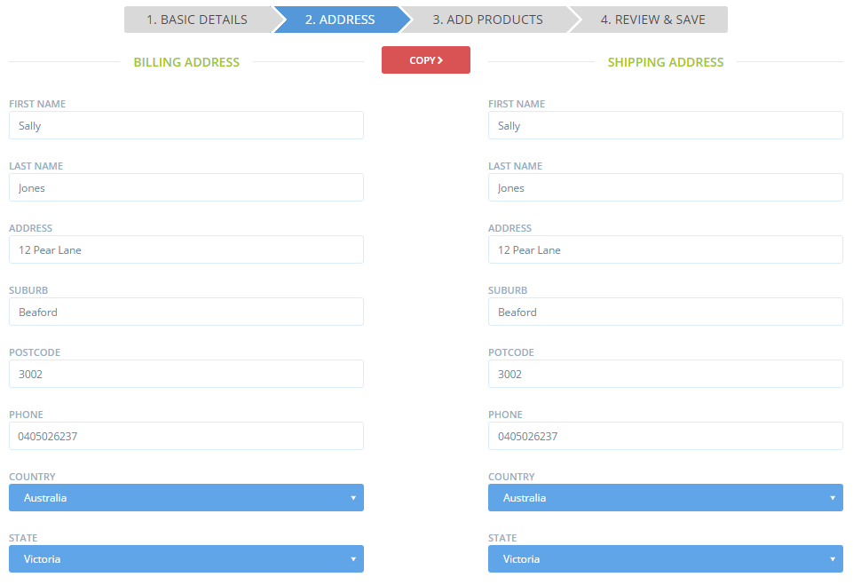

# Subscriptions- creating and managing orders

This page describes how shops can setup unique subscriptions for individual customers, including which items are in the subscription, which schedule the subscription applies to and pausing and editing the subscription.


 In this first version of the subscriptions feature, shops must setup subscriptions on behalf of their customers. There is no customer facing place where customers can setup their own subscription.


## 5\) Create subscriptions

Click on **Orders** in the blue horizontal menu and then select **Subscriptions** in the green sub-menu.

Click **+ New Subscription** to setup a recurring order for your customer.

**Customer:** 

Select a customer from the drop-down list.

\* You can only create a subscription for a customer who is on your [Customer List](https://openfoodnetwork.org/user-guide/advanced-features/customer-accounts-and-tagging/).

**Schedule:** Select the schedule, or order cycle group, that this customer wants to subscribe to.


you must have created a schedule of order cycles before you can create a subscription. Instructions [here](subscriptions-configuration.md).


**Payment method:** Select the customer’s preferred payment method. This must be either Stripe or a manual payment method such as cash. Paypal and Pin Payments are not supported for subscriptions.

**Shipping method:** Select the customer’s preferred shipping method.

**Begins at:** This is the date that the customer’s subscription will start to be generated. If this date is midway through an open order cycle in their schedule there will be an order generated for that order cycle. If not the first order will apply to the next order cycle which open in their schedule.

**Ends at:** After this date the customer’s standing orders will no longer be generated. This field is optional, if left blank the will continue to be generate indefinitely. 

How precisely does the end date interact with the OC dates? If the customer's subscription end date is after the opening date of an OC in their schedule, but before the end date of the OC, there won't be an order generated. The order will only be generated if the customer's end date, is after the OCs close date.

**Address:** Fill out the customer’s billing and shipping details. If there is saved customer shipping and billing details in your customers page, this information will load automatically.

**Add Products**

You can add any products that are in OCs that are within the schedule. You can't add products to a subscription if they aren't in any future order cycles within the schedule that the customer is subscribing to.

#### Summary

Check that details are correct and then click Create Subscription or Cancel.

**What happens if the price of a product changes after the subscription is made?**

The prices of items within subscriptions will update and the customer will be charged according to the updated price.

**What if a product in a subscription is not available in an order cycle?**

When an item in a subscription is not available the customer will be alerted in their confirmation emails.

## 6\) Edit a customer’s subscription

### Edit the base subscription

From the **Subscriptions** page, click on the **edit** button next to the subscription you want to edit.

From here you can edit which products are in the subscription, the preferred shipping and payment methods, the starting and ending dates and the customer’s details.


 You cannot change a subscription’s schedule. Instead the subscription must be recreated in the new preferred schedule.


Does changing customer details in Customer page update them in SO? \(?\)

### Edit one specific order

If you want to change a single upcoming order in a subscription you can click on the number in the customers’ orders column.

This will reveal all upcoming orders in the schedule, and you can then edit a specific order.

### Delete a subscription

From the **subscription** page, click the **cross** button next to the subscription you wish to delete. This will prevent any future subscriptions from being generated and delete this subscription permanently.


 If you delete a subscription while there is an open order cycle you'll be asked whether you want to keep the customer's open order, or if they want to delete the current order.


### Pause a subscription

From the subscriptions page, click on the **pause** button next to the subscriptions you wish to pause. This will prevent all future orders in the subscription from being generated, until it is activated again. To un-pause a subscriptions, click on the play button.


 If you pause a subscription while an order cycle is still open, you'll be asked whether you'd like to keep the current order or not. 



If you un-pause a subscription while an OC is open an order will be generated for this customer if they're subscribed to that schedule.


## 7\) How subscriptions are processed

So once subscriptions are setup, how are they processed each time a scheduel opens and closes?

**1\) An OC within a schedule opens:**

* This triggers the creation of subscription orders for your customers who are subscribed to the schedule. 
* The stocks level will be deducted accordingly at this time
* Each customer with a subscription order will get an email telling them that their order has been prepared.
* The shop notification email will receive an email summarising how many subscription orders there are.
* During the time when the OC is open the customers may be able to edit their order \(depending on you shop's settings\)

**2\) The OC closes**

* When the Order cycle closes the order will be confirmed.
* If customers are paying with Stripe, their credit card will be billed
* The customer will receive an email confirming that their order is complete.
* The shop notification email will get an email confirming how many subscription orders were processed. It will also mention any errors - such as a credit card that couldn't be billed.

